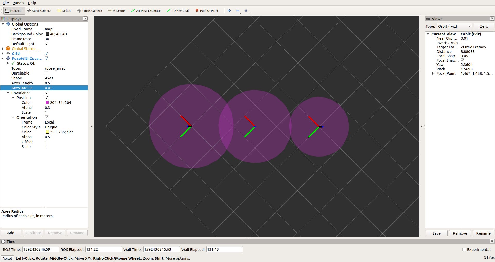

# Pose With Covariance Array RViz Plugin

This package defines the ROS message `PoseWithCovarianceArray` and its corresponding RViz plugin. The implementation of the RViz plugin is adapted from `PoseArray` from [RViz repository](https://github.com/ros-visualization/rviz).

## Compilation

The package is tested with ROS Melodic. Once ROS is installed, the package can be simply compiled with
```
catkin build -DCMAKE_BUILD_TYPE=Release
```
To Test the implementation, use the provided ROS node,
```
rosrun pose_with_covariance_array pose_with_covariance_array_test_node
```
Start RViz (with the workspace containing this package sourced), and add the topic `\pose_array`, the visualization should look like the following.


